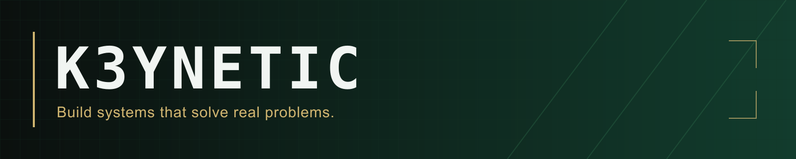

# Keywasie Dixon

**K3ynetic · Founder of Dixon Innovative Labs & Dixon Crypto Consulting**

AI Systems Developer · Embedded Systems & Agentic AI Engineering

I’m building an independent technology venture around software, intelligent systems, and practical engineering. My background in electronics and electrical systems shapes how I approach software: understand the whole system, take ownership, and improve it through hands-on work.

## About me

I’m a **United States Marine Corps veteran** with hands-on experience in electrical and electronic systems, aviation-support equipment, troubleshooting, preventive maintenance, and technical inspections. My background includes **power generation, electrical distribution, quality assurance, technical supervision, and process improvement**.

As an **Airspeed instructor**, I taught Lean Six Sigma principles, problem-solving, operational efficiency, and continuous improvement. That experience shapes how I approach engineering: understand the system, diagnose the problem, and improve the process.

### Credentials & technical training

- **U.S. Department of Labor apprenticeship:** Electrical Equipment Repairperson (Magneto Repairer), completed through the United Services Military Apprenticeship Program (USMAP) in 2022.
- **Veteran’s Advanced Manufacturing Pre-Apprenticeship:** completed at the Robert C. Byrd Institute in 2019.
- **Military Lean Six Sigma and Airspeed instructor training**, alongside aviation electronics and equipment-maintenance training.

I’m currently studying **Computer Engineering Technology at New York City College of Technology (CUNY)** and expanding my skills in software development, native macOS applications, automation, and AI.

My ambition is to grow **Dixon Innovative Labs** at the intersection of hands-on engineering, software, and intelligent systems. I’m especially focused on **local LLM systems, embedded AI, and practical intelligent tools**—developing useful applications with an emphasis on local operation, user control, and reliability.

## Companies

**Dixon Innovative Labs** is the umbrella for my software and engineering initiatives, with a focus on intelligent systems, automation, and emerging technologies.

**[Dixon Crypto Consulting Inc.](https://www.dixoncryptoconsult.io/)** provides cryptocurrency education, consulting, and digital asset research. Its focus includes blockchain fundamentals, digital asset security, and responsible technology adoption.

## Current development

### D3CRYPT10N DESKTOP EFFECTS (D3)

**In development · macOS software**

I’m developing a Matrix-inspired native macOS dynamic desktop experience under Dixon Innovative Labs. The direction emphasizes visual effects, performance, Apple Silicon, local operation, and user privacy.

I’m preparing D3 for a planned **Apple App Store release**, with a **custom version planned for GitHub**.

### Morpheus

Morpheus is a private personal AI systems research and development project.

## Technology & learning

My current development interests include **Python, Swift, macOS, and Apple Silicon**. I’m exploring **Metal and GPU rendering**, alongside **machine learning, large language models, agentic AI, and embedded systems**.

These are areas of development and learning. As public projects become available, I’ll document the technologies used and the work they demonstrate.

## Engineering philosophy

> Build systems that solve real problems.

I value independent thinking, systems-level problem-solving, security, reliability, and continuous improvement. My aim is to turn technical ideas into useful software and let the work demonstrate what I can do.

## Connect

[GitHub](https://github.com/K3ynetic) · [Dixon Crypto Consulting](https://www.dixoncryptoconsult.io/) · [LinkedIn](https://www.linkedin.com/in/keywasie-dixon-8a4845150/)
